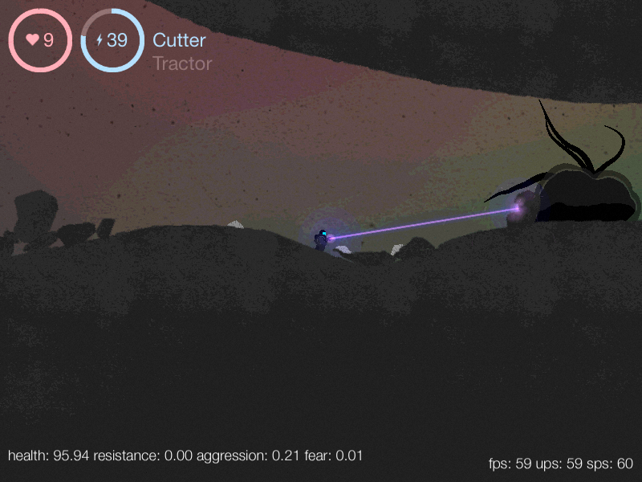
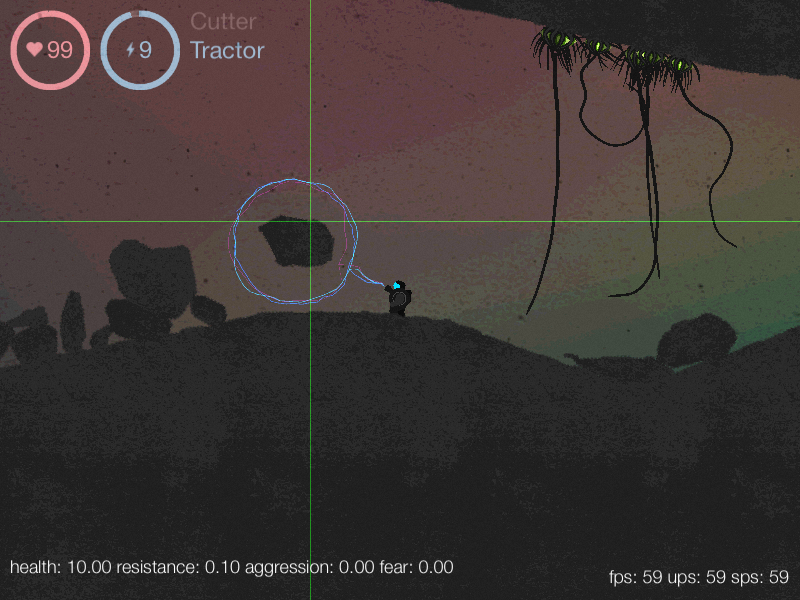
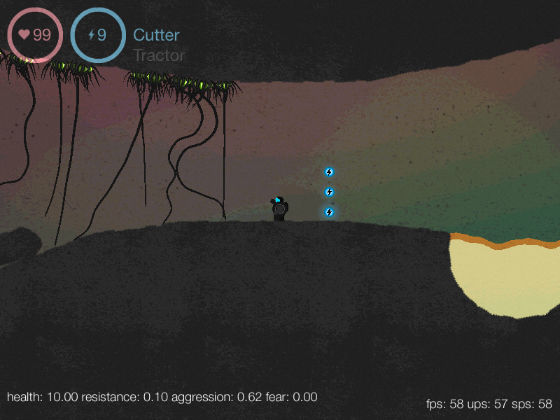

# Surfacer
A silly, unfinished 2d game with novel physics

---

A few years ago I had an idea for destructible 2D terrain (2D voxels, tesselated via a 2D decomposition of marching cubes), and thought it would make a great game. I made a lot of progress, but for various reasons, I never finished it. And with the march of progress, it no longer even compiles! 

I want to correct this, and while I may not finish the game, I would like to get it running again and maybe, just maybe, make something people want to fuss with.

---

##Building

Right now, Surfacer does *not* build. Back in the day, Surfacer *did* build using `libcinder` 0.7.x, and `chipmunkphysics` 0.6.x, and Xcode 5.x. Modern Xcode will not accept the pre-c++0x11 malarkey, and frankly, I think it's time to update to more modern C++ syntax anyway. 

When Surfacer is building, I'll include instructions.

##Features

- destructible 2D terrain, where the player can cut pieces off the environment and use the gravity gun to reposition those pieces to cross lava, attack baddies, make a defensive wall, etc.

- soft-body physics for jelly-like shambling enemies

- entities "skinned" via svg

- primitive liquid approximation via particle dynamics

- post-processing GLSL effects for damage, etc

##Screenshots

The gun does nothing!

Maybe I can toss a boulder?

How do I get past?

